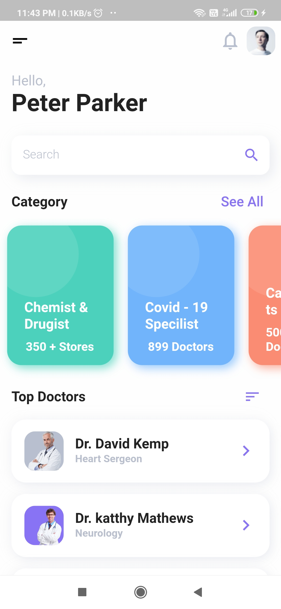
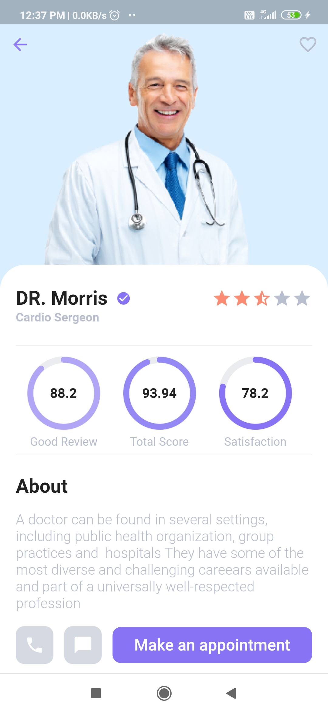
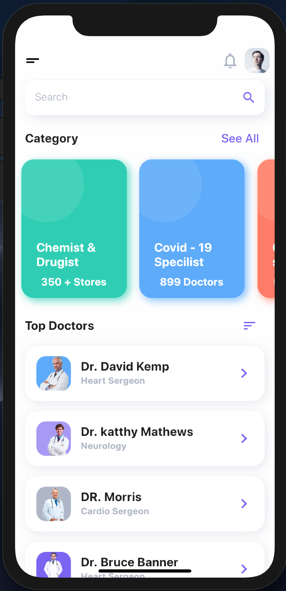
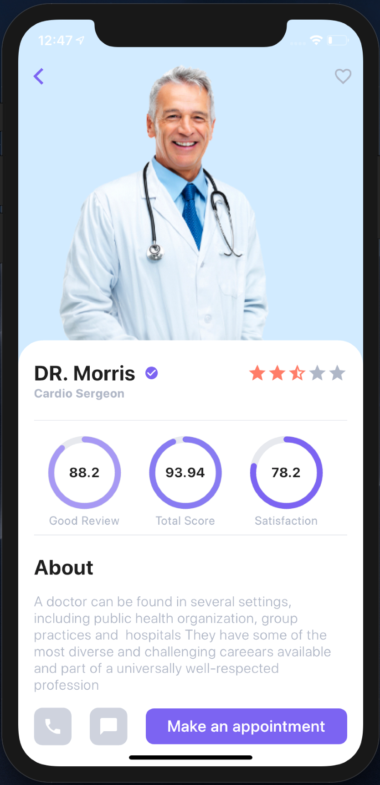

# Healthcare App

A polished Flutter healthcare portfolio application with doctor discovery, appointment booking, clinic location support, and smooth mobile navigation.

## Overview

This repository contains a complete Flutter healthcare mobile app designed for Android and iOS. It showcases a modern healthcare experience with a doctor directory, appointment workflow, and location-aware clinic browsing.

## Features

- Doctor directory with specialty filters, ratings, and profile cards
- Appointment scheduling with date/time selection and patient details
- Google Maps clinic location support and geolocation
- Responsive mobile UI with custom navigation and transitions
- Local state handling with Provider and shared preferences
- Cached network images and reusable UI widgets

## Preview


## Screenshots

### Android

  Home Page | Detail Page  
  --------- | ------------  
   | 

### iOS

  Home Page | Detail Page  
  --------- | ------------  
   | 

## Project Structure

```text
lib/
  main.dart
  src/
    config/
      route.dart
    model/
      dactor_model.dart
      data.dart
    pages/
      detail_page.dart
      home_page.dart
      splash_page.dart
    theme/
      extention.dart
      light_color.dart
      text_styles.dart
      theme.dart
    widgets/
      coustom_route.dart
      progress_widget.dart
      rating_start.dart
pubspec.yaml
screenshots/
  HealthcareMobileApp.png
  screenshot_1.jpg
  screenshot_2.jpg
  screenshot_ios_1.png
  screenshot_ios_2.png
test/
  widget_test.dart
```

## Requirements

- Flutter SDK (stable channel).
- Android Studio or Xcode installed for Android/iOS builds.
- Google Maps API keys configured if using location features on a real device.

## Installation

1. Install Flutter SDK and confirm with `flutter doctor`.
2. Open this project in your preferred editor.
3. Run `flutter pub get`.
4. Run the app with `flutter run`.

## How to run

- Android: connect an Android device or start an emulator, then run `flutter run`.
- iOS: open the project in Xcode or run `flutter run` with a connected iOS device.
- Tests: run `flutter test`.

## Notes

- Add `.gitignore` before pushing to GitHub to exclude build artifacts and local config.
- Keep `pubspec.yaml` dependencies compatible with your Flutter SDK version.
- Replace screenshot assets and app metadata as needed for branding and deployment.
